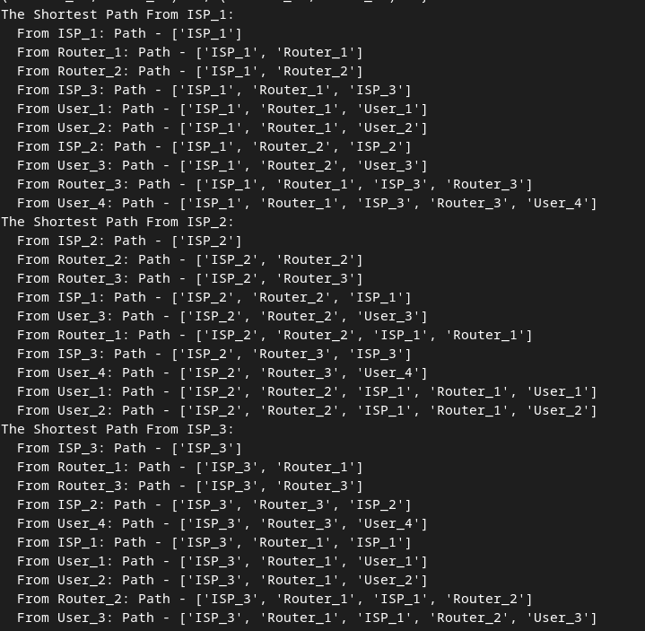
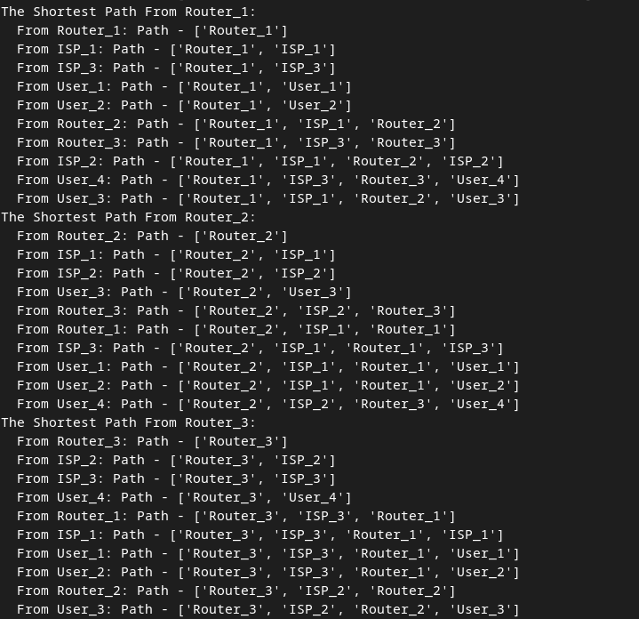

### Завдання 1 ([task1.py](task1.py))

Створіть граф за допомогою бібліотеки networkX для моделювання певної реальної мережі (наприклад, транспортної мережі міста, соціальної мережі, інтернет-топології).

Візуалізуйте створений граф, проведіть аналіз основних характеристик (наприклад, кількість вершин та ребер, ступінь вершин).

### Завдання 2 ([task2.py](task2.py))

Напишіть програму, яка використовує алгоритми DFS і BFS для знаходження шляхів у графі, який було розроблено у першому завданні.

Далі порівняйте результати виконання обох алгоритмів для цього графа, висвітлить різницю в отриманих шляхах. Поясніть, чому шляхи для алгоритмів саме такі.

 - <b>DFS</b> (Пошук в глибину): Алгоритм DFS намагається йти глибше від стартового вузла до кінцевого, доки не знайде шлях. Це призводить до того, що він може спочатку досліджувати один "шлях" від старту, не перевіряючи всі можливі варіанти, тому може пройти довшим або менш ефективним маршрутом. Також може знайти шлях, який буде не найкоротшим, але піде глибше по мережі, досліджуючи більше сусідніх вузлів, не перевіряючи інші можливі варіанти до кінця.
 - <b>BFS</b> (Пошук в ширину): Алгоритм BFS досліджує всі сусідні вузли поточного рівня перед тим, як перейти до наступного рівня. Це означає, що BFS зазвичай знаходить найкоротший шлях, але не обов'язково найбільш "глибокий" або специфічний. Зазвичай знаходить найкоротший шлях, оскільки він обробляє вузли рівень за рівнем і одразу досліджує всі доступні сусіди.

<b>DFS:</b> фокусується на пошуку максимально глибокого шляху і може не гарантувати найкоротший шлях, оскільки спочатку досліджує один шлях, перш ніж повернутись назад.

<b>BFS:</b> фокусується на найкоротшій відстані від старту до цілі, тому спочатку перевіряє всі сусідні вузли, перш ніж заглиблюватися далі.

Таким чином, <b>BFS</b> зазвичай корисний для пошуку мінімальних шляхів, тоді як <b>DFS</b> може бути ефективним для пошуку глибоких шляхів або всіх можливих шляхів до вузла.

### Завдання 3 ([task3.py](task3.py))

Реалізуйте алгоритм Дейкстри для знаходження найкоротшого шляху в розробленому графі: додайте у граф ваги до ребер та знайдіть найкоротший шлях між всіма вершинами графа.

 - Як і в попередніх завданнях, ми додаємо вузли та ребра між ними.
 - Додаємо ваги до кожного з'єднання. У цьому прикладі ребра мають різні значення ваг, які імітують різні відстані або затримки в мережі.
 - <b>Алгоритм Дейкстри:</b> Використовуємо метод <b>nx.all_pairs_dijkstra_path</b> з бібліотеки <b>networkx</b>, щоб знайти найкоротший шлях між усіма парами вершин.
 - Програма виводить найкоротший шлях від кожної вершини до всіх інших.

Алгоритм <b>Дейкстри</b> знаходить найкоротший шлях з урахуванням ваг ребер. 

Наприклад, від <b>ISP_1</b> до <b>User_4</b> шлях проходить через кілька маршрутизаторів, і алгоритм вибирає такий маршрут, який мінімізує сумарну вагу ребер (відстані між вузлами).
